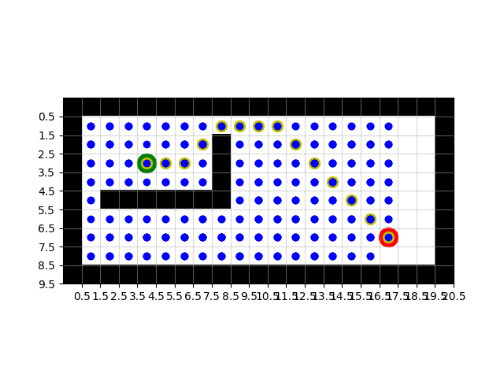

# Overview
This repo contains code for running search algorithms. General classes are provided to define search problems and agent dynamics. A simulator is developed on a 2D grid and solved with A*. 

## The code is seperated into three main modules:
* **search_method.py** A method for finding a plan from a start state to a goal state.
* **search_problem.py** A definition of a search problems start state, end condition and what the successors of each state are
* **world.py** A definition of how a state evolves for a given action (i.e. dynamics), which states are valid (i.e. not in collision with an obstacle) and how cost is assigned (i.e. distance).

## The remaining code provides setup and visualization:
* **visualization.py** code for loading mazes and visualization
* **util.py** Utilities, priority queue, etc.
* **run.py** Main setup code for running search
* **.maze files** provide a description of a maze to be searched and easily tested

# Execution
## Examples
1. A* search using manhattan distance heuristic on the "hard" maze.
```
python run.py hard -m astar
```


2. A* search using manhattan distance heuristic on the "expansive" maze 
```
python run.py expansive -m astar
```


3. Breadth first search on the expansive maze
This shows how much the choosen heuristic is guiding the search and reducing the search space.
```
python run.py expansive -m bfs
```


## Usage
```
run.py -h
```
usage: run.py [-h] [-m SEARCHMETHOD] [-p SEARCHPROBLEM] [-w WORLD] mazename

positional arguments:
  * mazename             The name of a maze file in the maze folder, excluding
                         .maze suffix

optional arguments:
  * -h, --help          show this help message and exit
  * -m SEARCHMETHOD, --searchmethod SEARCHMETHOD
                        The type of search method used e.g. (bfs, astar)
  * -p SEARCHPROBLEM, --searchproblem SEARCHPROBLEM
                        The search problem that is being solved, must be in
                        search_method.py
  * -w WORLD, --world WORLD
                        The agents world in world.py, defines how states
                        evolve, which states are valid and how cost is
                        assigned
**Note**: Currently there is only one world implemented and one search problem implemented, but the code is designed to be general and more worlds and search problems could be added.

# Design Considerations
## The problem statement was as follows:
Build a simulator to initialize a grid space with a start state, goal state, and obstacles. Design and implement a path planning algorithm using an optimization approach that solves for a policy to guide the robot from the start state to the goal state.

## Approach
I considered a number of different planning algorithms: RRT, A star, Value iteration (Dynamic programming) and sequential quadratic programming. I settled on an implementation of A star. A star garuntee's a global optima and is able to handle arbitrary costs. With a well designed heuristic it can be extended to fairly large state and action spaces.

I designed the code to be general. A world defines how states evolve, which states are valid and how cost is assigned to states. The problem defines the start, goal and which states are successors. The code I wrote subclasses problem to search from point to point. Other problems could be created as well for example the same code could be used to solve the traveling salesmen problem to a set of goals.

A star and breadth first search are specific implementations of the more general tree search. They differ in the way they manage the fringe. I implemented a priority queue using a heap and priority function which defines the priority of given nodes, this gives me O(1) access to the highest priority item.

I used matplotlib for the visualization - I choose this because its a tool im familiar with and I wanted to view something quickly. Using matplotlib for maze visualization is not the usual use case. If visualizations needed to extend much further it would be better to use a dedicated visualization tool like rviz.

## Future extensions
Depending on problem specifics I would like to add more accurate heuristics. For the hard maze the heuristic doesn't prune the states very much compared do breadth first search. 

RRT - use an RRT to plan with continous state spaces and action spaces. Given the open endedness of the problem I decided to implement A star, but if I had to act in continuous action spaces and state spaces RRT would by my next choice.

# Dependencies
* matplotlib
* numpy
* python3


